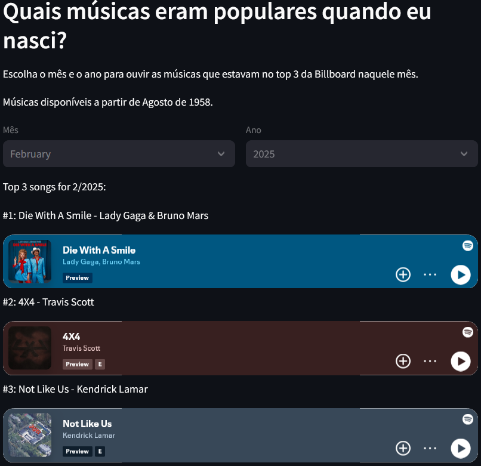

# StreamlitDA

Desafio Acelerado Minerva

Para executar o projeto, é necessário credenciais do Spotify Developer.

Podem ser obtidas em: https://developer.spotify.com/dashboard/applications

Após obter as credenciais, é necessário substituir as strings de client_id e client_secret no arquivo app.py.

Para executar o projeto, é necessário instalar as bibliotecas necessárias.

```bash
pip install -r requirements.txt
```

E então executar o arquivo app.py.

```bash
streamlit run app.py
```
Por fim, basta escolher o mês e o ano para ouvir as músicas que estavam no top 3 da Billboard naquele mês.


