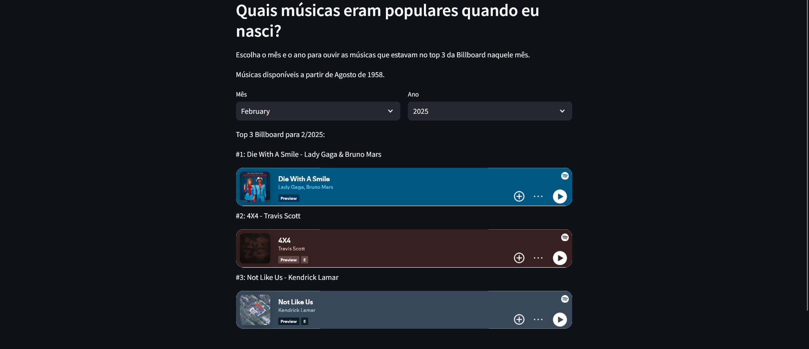

# StreamlitDA

Desafio Acelerado Minerva

O arquivo app.py é o arquivo principal do projeto. Ele executa a aplicação Streamlit.

O arquivo `getLinks.py` é responsável por enriquecer os dados do dataset, utilizando a API do Spotify para obter os links de cada música. Ele processa o arquivo `hot-100-current_Filtered.csv` e gera como saída o arquivo `music_with_spotify_links.csv` com os links correspondentes.

Para executar o projeto, é necessário credenciais do Spotify Developer.

Podem ser obtidas em: https://developer.spotify.com/dashboard/applications

1. Acesse o **Spotify Developer Dashboard**
2. Faça login com sua conta Spotify
3. Clique em "**Create app**"
4. Vá para "**Settings**" do seu app
5. Na seção "**Basic Information**", você encontrará:
   - **Client ID**
   - **Client Secret**

Após obter as credenciais, é necessário substituir as strings de client_id e client_secret no arquivo app.py.

Para executar o projeto, é necessário instalar as bibliotecas necessárias.

```bash
pip install -r requirements.txt
```

E então executar o arquivo app.py.

```bash
streamlit run app.py
```
Por fim, basta escolher o mês e o ano para ouvir as músicas que estavam no top 3 da Billboard naquele mês.


